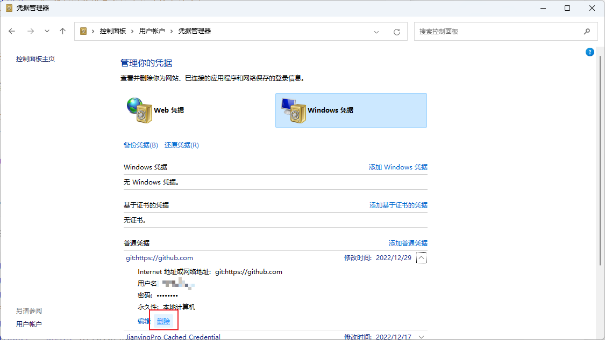

# useful-git-snippets
记录一些实用的git命令片段（以及一些技巧备忘）😇

---

- 查看指定文件相关提交历史的简洁方式

```bash
git log --pretty=oneline 目标文件
```

- 更新当前仓库主分支下的`gitignore`策略

```bash
git status --ignored # 查看被忽略的文件
git rm -r --cached . # 递归清除所有缓存文件（及文件夹）
# 重新添加全部文件并提交
git add . 
git commit -m "chore: 更新gitignore策略"
git push # 提交至远程仓库
```

- 清空仓库先前全部提交记录

```bash
# 原理是检出孤立分支以备份原主分支，再删除主分支后重命名备份分支
git checkout --orphan temp_branch
git add .
git commit -am "build: 清空仓库历史提交记录"
git branch -D master # 强制删除原主分支
git branch -m master # 将当前分支（temp_branch）重命名为master
git push -f origin master # 将更新名称后的主分支强制推送到远程仓库
```

- 为`Git`配置全局代理

``` bash
git config --global http.sslverify false
git config --global http.proxy http://127.0.0.1:你的代理端口
git config --global https.proxy http://127.0.0.1:你的代理端口
# 删除重置上述参数
git config --global --unset http.sslverify
git config --global --unset http.proxy
git config --global --unset https.proxy
```

- 清除当前设备上的`Github`已登录鉴权账户信息

<center ></center>

- 修改最近一次commit备注信息

```bash
git commit --amend
```

　　接着进入`vim`编辑保存即可

